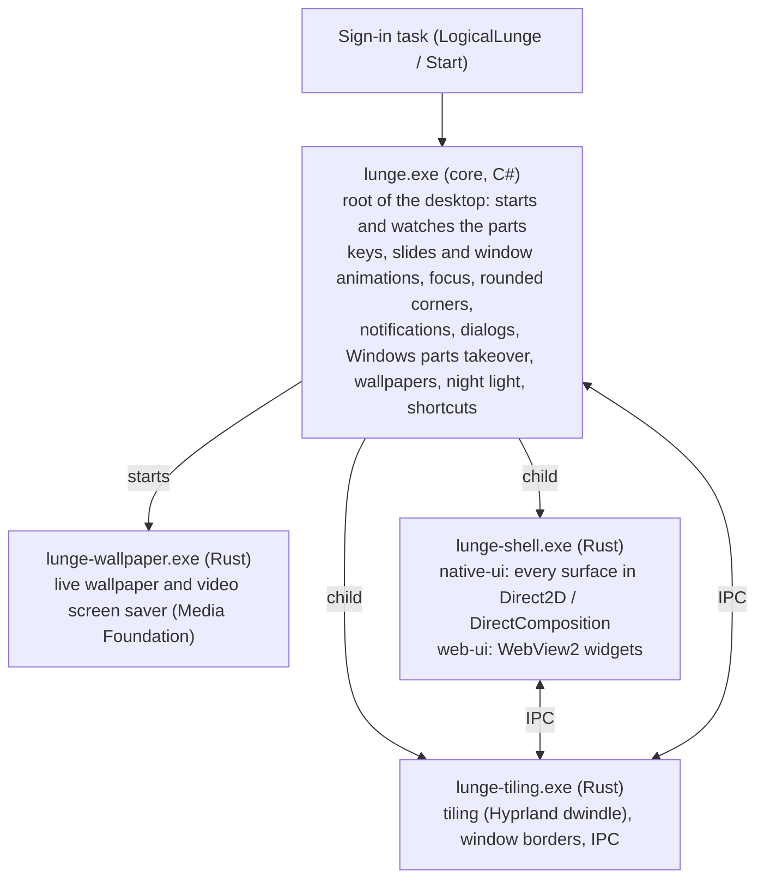

<div align="center">

# Logical Lunge

**The ultimate Hyprland experience for Windows.** (One core, two interfaces).

Windows için kusursuz Hyprland deneyimi. (Tek çekirdek, iki arayüz).

[](#compatibility)
[](#how-it-works)
[](#languages)
[](https://logical-lunge-web-demo.vercel.app/)
[](LICENSE)

<!-- Screenshots are added after the first clean-machine test run (docs/screenshots/). -->

**[English](#english) · [Türkçe](#türkçe)**

</div>

> [!NOTE]
> Logical Lunge brings the **Hyprland experience to Windows**. It is a complete desktop environment with its own native window manager (`lunge.exe` and `lunge-tiling`), high-performance graphics, and limitless customization. (GPL-3.0, see [Credits](#credits--teşekkürler)).

---

## English

### 🔀 Choose Your Experience

Logical Lunge is a complete Windows desktop environment replacement. It uses a single core and window manager (`lunge.exe` and `lunge-tiling`), but offers two different interface paradigms developed on parallel branches.

| ⚡ Native UI (`native-ui` branch) | 🎨 Web UI (`web-ui` branch) |
| :--- | :--- |
| **Zero Input Lag:** every surface drawn with Direct2D & DirectComposition — no WebView, no browser engine. | **Infinitely Customizable:** Built with React, HTML, and CSS (WebView2). |
| **Max Performance:** compositor-level animations, a plain Win32 shell process. | **Themeable:** Easily write your own CSS themes and layouts. |
| **Best for:** Laptops saving battery, gaming PCs maximizing resources. | **Best for:** Web developers and power users who love to tweak UIs. |
| 👉 **[Explore Native UI Code](https://github.com/KaanAlper/logical-lunge/tree/native-ui)** | 👉 **[Explore Web UI Code](https://github.com/KaanAlper/logical-lunge/tree/web-ui)** |

#### 🌐 Try the Live Web Demo
Curious how it feels before installing? We built a **[Live Web Demo](https://logical-lunge-web-demo.vercel.app/)**! It runs the web edition's React UI in your browser with mocked system data (CPU, RAM, Workspaces, Settings). You can interact with the top bar, settings, sidebar, and see the tiling windows in action right on the web.

### ⚡ Quick install

Open **PowerShell** and paste:

```powershell
irm https://raw.githubusercontent.com/KaanAlper/logical-lunge/main/install.ps1 | iex
```

A short wizard asks for the interface edition, accent color, language and clock, then one admin prompt; everything else downloads and installs on its own. If anything fails (or you press Ctrl+C) everything is put back. Prefer a window? Download **LogicalLunge-Setup-x64.exe** (or **-x86.exe**) from the latest `setup` release.

### Interface editions

| Edition | Interface | Release tag / Package |
|---|---|---|
| `native-ui` | Everything native (Direct2D / DirectComposition): bar, Super menu, notification cards, right panel, settings, Dock, on-screen keyboard, session screen, update card, dialogs, menus and desktop widgets. The shell is a plain Win32 program — no WebView2, no Tauri. | `vX.Y.Z-native-ui` / `LogicalLunge-native-ui-X.Y.Z.zip` |
| `web-ui` | WebView2 bar, Super menu, panels and Dock (React / HTML / CSS). | `vX.Y.Z-web-ui` / `LogicalLunge-web-ui-X.Y.Z.zip` |

Explorer keeps running underneath (desktop icons, file manager); the parts of Windows' shell Logical Lunge replaces are switched off while it runs and come back when it stops.

The shared installer downloads the latest complete, non-draft release for the selected edition and verifies its SHA-256. The updater stays on the installed edition. Each edition has its own version line following **semantic versioning**: a release with new features raises MINOR, one with only fixes raises PATCH, a breaking change raises MAJOR (decided from the commits since the last release).

Set `$env:LL_EDITION = 'native-ui'` or `'web-ui'` to select the default edition; add `$env:LL_DEFAULTS = 1` to skip questions.

### What this is

A Windows desktop environment with tiling window management, a bar, side panels, app search, animations and configurable shortcuts:

- **Tiling** with Hyprland's dwindle layout (`lunge-tiling`), kept as a real binary tree like Hyprland's: a new window splits the window under the mouse along its longer side and opens on the half the mouse is over (`force_split = 0`); `movewindow` splits the window at the focal point the same way, moving a window toward its split partner swaps the two, and a window that leaves gives its space back to its split partner, so the halves stay halves however much you rearrange. `Super + J` turns a split around (`togglesplit`). New windows never flash at the screen centre — they appear only once in place. Apps that maximize or go fullscreen inside their tile stay in their tile.
- **Window borders** drawn by the window manager itself: your focus color (chosen at install, `borders.active_color` in the config) for the focused window, subtle for the others, only on windows the WM manages (never on the bar, menus or picture-in-picture), moving in the same step as their window.
- **Bar**: workspaces with app icons (numbers cross-fade in while you switch with Ctrl+Super), resources (RAM / swap / CPU / **CPU & GPU temperature**), media with album art and seeking, tray with drag-to-pin, clock, battery, scroll-to-change brightness (left edge) and volume (right edge) with an OSD.
- **Super menu**: fuzzy app search (localized names and icons; Steam, Epic and itch games and apps too; newly installed apps appear within seconds), calculator (`sqrt(9)`, `5!`, `2^10`, `50%`), `/actions`, `$shell`, `?web`, **Google Lens** region search, **music recognition** (Shazam), **file search** (`#`, every indexed drive through Everything — NTFS drives update instantly, USB sticks and network folders are rescanned on their own), clipboard (`;`), workspace previews. Our own right-click menu on apps (open, run as administrator, keep in Dock, open file location, uninstall, properties).
- **Right panel**: Android-style quick toggles (Wi-Fi with network list and password, Ethernet, Bluetooth with paired devices, keep-awake, mic, audio output/input, night light with schedule + intensity, dark mode, screenshot, on-screen keyboard, do-not-disturb) with slide-down cards and press-and-hold reordering, notifications, calendar with month/year picker, to-do, pomodoro, and an **issue report** form (drafts are kept if the panel closes).
- **Wallpaper page** (tabs: Wallpaper / Live / Screen saver / Store): per-monitor images or one image spanning all monitors (*superscreen*); **live wallpapers** — videos behind the desktop icons, decoded on the GPU, pausing for fullscreen apps, a locked or dark screen and (optionally) battery; **one store** for live wallpapers and screen savers; import a video file, a Lively package or a Wallpaper Engine video project; right-click a gallery item to apply it, open its folder or remove it.
- **Screen savers**: Windows' screen savers in a gallery with bulk `.scr`/`.zip` import, plus the **video screen saver** (`LogicalLunge.scr`): any library or store video, on every monitor, started by Windows itself with its own timeout and sign-in-on-resume.
- **Desktop widgets** (`native-ui`): clock, media, system, weather (Open-Meteo), agenda and notes on the desktop — on every workspace, added from the desktop menu, dragged and resized on a grid, saved per monitor.
- **Desktop right-click** and every other menu are Logical Lunge's own: view (icon size, auto arrange, show desktop icons), sort, new folder / text document, paste, and on icons open, run as administrator, open with, cut, copy, rename, delete (to the Recycle Bin, undoable), properties. Windows' own menu never appears.
- **Notifications and questions**: Windows app notifications and every notice of ours show as Logical Lunge cards at the top right (do-not-disturb holds them back); questions (Yes / No, with an optional checkbox) appear in our own dialog in the centre. Our programs never show Windows' error boxes: a file that cannot be opened gets a card saying why (with *Open with*), and a crashed part is restarted and reported.
- **Settings window**: theme and accent (presets and custom colour), **interface scale** (85–150 %, everything scales together and stays on screen; Windows' *Text size* setting is followed too), animations, gestures, notification timing, workspaces and monitors, language and clock, night light, system health, advanced (incl. the *Replace Windows parts* switch).
- **Keyboard**: Logical Lunge owns every Win-key combination while it runs — Start, Search, Action Center and Win+X never open. The **shortcut editor** (right panel) stages edits until *Save*, shows conflicting rows in red (Save shakes and a card lists them), lets you add a shortcut for any app (from the app list or a file) and remove any app row, and *Reset* asks whether your own app shortcuts should go too.
- **Replaces Windows' shell while it runs**: taskbar (on every monitor, nothing reserved), notification banners, Snap layouts and shake-to-minimize, the touch keyboard and the Widgets / Task View / Copilot buttons are switched off at their source; every previous value is saved and restored exactly when the desktop stops, crashes or is uninstalled. If the bar is missing for 20 seconds Windows' taskbar comes back until it returns.
- **Dock** (Super + Alt): pinned and running apps with magnification; **on-screen keyboard** that never takes focus; **session screen** with lock / sleep / reload desktop / sign out / restart / UEFI-BIOS / shut down.
- **Screenshot tool** (Print): select a region, then annotate — pen, circle, rectangle, colors — copy or save as. **Ctrl+Print**: the whole monitor under the mouse to the clipboard and `Pictures\Screenshots`.
- **Clipboard history** (Super+V): text and images, searchable.
- **Alt+Tab switcher**: live window previews across all workspaces, most recently used first, drawn natively by the core.
- **It heals itself**: if the window manager, the bar or the core crashes or hangs, the part is restarted automatically (windows hidden on other workspaces come back first). *Reload desktop* (session screen, right panel, or *Restart Logical Lunge* in the Start menu) restarts everything cleanly.
- **Updates**: the update card checks GitHub releases, shows download progress, then *Install now* / *Later*. Installing asks for administrator permission first, in front of the desktop, then restarts it.
- **Animations**: workspace slides, window open / close / move animations (Hyprland `emphasizedDecel` curves), popups that slide in and out; durations and bezier curves are set like Hyprland's `bezier =` / `animation =` lines in the `animations:` section of the config.
- **Touchpad gestures** (precision touchpads): three fingers sideways move the workspace with your fingers, up opens the Super menu, down the right panel, four fingers move the focused window.
- **Terminal**: WezTerm (JetBrains Mono Nerd Font, wallpaper-generated Material You colors) running **fish** with **starship**.
- **Boot straight into the desktop**: a wallpaper splash covers Windows until the shell is ready.

### Why this exists

Windows desktop integration requires handling these cases:

1. **Lone Super opens Start**, and Ctrl+Super spam leaks it anyway → the core owns the Win key completely; every Win combination goes to Logical Lunge's shortcut table or the window manager and never reaches Windows (Win+L stays Windows' secure lock).
2. **The upstream window manager's focus/move jumps to the other monitor** when there is no window in that direction → focus and move stay inside the workspace; moving at an edge re-splits the layout like Hyprland.
3. **Workspace switches lag** by 100–200 ms with many windows → the slide starts from DWM thumbnails before the WM finishes, at high process priority.
4. **Apps reset rounded window regions**, dialogs flicker under focus-follows-mouse, Windows error boxes pop up → rounded corners kept, focus follows real mouse movement, and our programs report errors as cards instead of creating Windows' boxes.
5. **Everything had to survive a reboot and a different PC** → one installer, one UAC prompt, every Windows setting backed up and restored on uninstall.
6. **Foreign programs don't feel like one desktop** → they became parts of one app: `lunge.exe` starts `lunge-tiling` and `lunge-shell` as its own children (Task Manager shows one *lunge*), one config folder, one log folder, and the parts recover from crashes on their own.

### Install

**One command** (PowerShell):

```powershell
irm https://raw.githubusercontent.com/KaanAlper/logical-lunge/main/install.ps1 | iex
```

A short wizard asks for the interface edition, accent color, language and 12/24-hour clock and which extras you want. Windows asks for permission **once**. The installer downloads whatever is missing — the Visual C++ runtime (and WebView2 for the web edition only), and pinned, tested versions of WezTerm, the Nerd Font, fish (MSYS2), starship, eza, LibreHardwareMonitor and Everything (checked against its published SHA-256; an Everything you already have is used instead), installs the shell, backs up and applies the Windows settings, and starts the desktop. The windowed **setup app** (x64 / x86) does the same with a graphical wizard.

| Option (set before running) | Effect |
|---|---|
| `$env:LL_NO_TERMINAL = 1` | Skip WezTerm + fish + fonts |
| `$env:LL_NO_SENSORS = 1` | Skip the PawnIO driver (no CPU temperature) |
| `$env:LL_NO_EVERYTHING = 1` | Skip Everything (no file search with `#` in the Super menu) |
| `$env:LL_DEFAULTS = 1` | No questions: default choices |
| `$env:LL_PLAIN = 1` | Simple numbered prompts instead of the TUI |

Every change is backed up first. If a step fails, or you cancel with Ctrl+C, the installer puts back the previous files, settings, registry values and tasks and starts your previous desktop again. It only stops processes running from its own files — another program with the same name, or a terminal you opened from our tools folder, is left alone.

| Where | What |
|---|---|
| `%ProgramFiles%\LogicalLunge` | The app (`lunge.exe`, `lunge-tiling.exe`, `lunge-shell.exe`, `lunge-wallpaper.exe`, `LogicalLunge.scr`, tools); protected, because the core and the window manager run with administrator rights so that shortcuts and window management also work over administrator windows. The shell and every program you open run as you. |
| `~\.config\logical-lunge` | Your settings: `config.yaml` (window manager, borders, focus color), `keybinds.json`, `prefs.json` (language, clock, interface scale, …) |
| `%LOCALAPPDATA%\LogicalLunge` | Data: `logs\` (one log folder for all parts), `state\`, clipboard history, desktop widgets, wallpaper library |

**Update:** the update card (right panel → update, or Settings → About), or run the one-liner again. Your `config.yaml` is replaced only if you never edited it (otherwise the new default is saved next to it as `config.default.yaml`).

**Uninstall:** *Settings → Apps → Logical Lunge → Uninstall*, or run `%ProgramFiles%\LogicalLunge\uninstall.ps1`. Every Windows setting goes back to what it was and config files you had before the install come back. While the desktop runs the question comes in our own dialog; you're asked whether Logical Lunge's own settings and data should be deleted too (`-RemoveConfig` / `-KeepConfig` skip the question). Windows on other workspaces are brought back before anything is removed.

### Troubleshooting

- **Logs**: `%LOCALAPPDATA%\LogicalLunge\logs` — the core, the shell, the window manager and the live wallpaper player (`live-wallpaper.log`) all write there.
- **Issue report**: right panel → issue report sends a description with the recent logs and a black-box snapshot.
- **Something stuck**: *Reload desktop* on the session screen restarts every part; Settings → System health shows what runs.
- **Windows parts back**: Settings → Advanced → *Replace Windows parts* off restores them while Logical Lunge keeps running.

### Default keybinds

| Keys | Action |
|---|---|
| `Super` · `Ctrl + Esc` · `Super + R / Q / Tab` | Super menu / search |
| `Super + S` | File search (the Super menu opens with `#`) |
| `Super + V` | Clipboard history |
| `Super + ←↑→↓` | Focus inside the workspace (the mouse follows) |
| `Super + Shift + ←↑→↓` | Move window / re-split the layout |
| `Super + Ctrl + ←/→` | Previous / next workspace (slide) |
| `Super + Ctrl + Shift + ←/→` | Move window to previous / next workspace |
| `Super + 1…0` | Workspace 1–10 |
| `Super + Enter` / `Super + T` | Terminal (WezTerm + fish) |
| `Super + W / E / C / X` | Browser / files / code editor / text editor |
| `Super + F` | Fullscreen |
| `Super + J` | Turn the split around (side by side ↔ stacked) |
| `Super + Alt` | Dock |
| `Super + I` | Settings |
| `Super + A` / `Super + N` | Right panel |
| `Print` · `Super + Shift + S` | Screenshot + annotate |
| `Ctrl + Print` | Whole monitor to clipboard + `Pictures\Screenshots` |
| `Ctrl + Shift + Esc` | Task Manager |
| `Alt + Tab` | Window switcher |
| `Alt + F4` | Close window |
| `Super + L` | Lock (Windows') |

All of them can be changed in **right panel → ⌨ Shortcuts**.

### Compatibility

| | Status |
|---|---|
| Windows 10 22H2 (19045) | Developed and tested here |
| Windows 11 | Supported by every component (window manager, Direct2D / DirectComposition, WebView2 for the web edition, both desktop layouts of the live wallpaper incl. 24H2). First clean-machine test pending. |
| ARM64 | Not yet (the app is built for x64) |

### Languages

The UI follows the system language (or the one picked in the installer): English, Deutsch, Français, Español, Italiano, Português, Русский, Українська, Polski, 日本語, 中文, 한국어, العربية (right-to-left) and Türkçe. Dates and month/day names use the system locale.

### How it works



Each edition branch holds `core/` (the root process), `tiling/` (window manager), `shell/` (the shell and the live wallpaper player), `ui/` (fonts and translations; the web edition's widgets), `scripts/`, `tools/` and `config/`; `main` holds the shared installer, the setup app and the release workflows. One install, one uninstall, one autostart, one entry in *Settings → Apps*, one config folder, one log folder — but still cooperating processes, so a crash in one part never takes the others down.

**Roadmap:** see [docs/ROADMAP.md](docs/ROADMAP.md).

### Build from source

```powershell
git clone -b native-ui https://github.com/KaanAlper/logical-lunge; cd logical-lunge   # or -b web-ui
.\build.ps1                  # -> dist\LogicalLunge-<edition>-<version>.zip
$env:LL_SOURCE = "$PWD\dist\LogicalLunge-$(Get-Content EDITION)-$(Get-Content VERSION)"; .\install.ps1
```

Needs Rust (rustup; the toolchain is pinned in `tiling/` and `shell/`), the Windows 10 SDK (for `lunge-media.exe`), Python 3.12 (packaged tools are built with PyInstaller — the target PC needs no Python) and Node.js (translations). `-SkipRust` / `-SkipPython` reuse earlier builds.

---

## Türkçe

### 🔀 Deneyimini Seç

Logical Lunge tam bir Windows masaüstü ortamıdır. Tek bir çekirdek ve pencere yöneticisi (`lunge.exe` ve `lunge-tiling`) kullanır, ancak paralel branch'lerde geliştirilen iki farklı arayüz deneyimi sunar.

| ⚡ Native UI (`native-ui` branch'i) | 🎨 Web UI (`web-ui` branch'i) |
| :--- | :--- |
| **Sıfır Gecikme:** Her yüzey Direct2D ve DirectComposition ile çizilir — WebView yok, tarayıcı motoru yok. | **Sınırsız Özelleştirme:** React, HTML ve CSS (WebView2) ile inşa edilmiştir. |
| **Maksimum Performans:** Animasyonlar doğrudan birleştiricide, kabuk sade bir Win32 programı. | **Tema Desteği:** Kendi CSS temalarınızı ve düzenlerinizi kolayca yazabilirsiniz. |
| **Kimin için:** Pil tasarrufu isteyen laptoplar, kaynakları maksimize eden oyuncular. | **Kimin için:** Arayüz kurcalamayı seven Web geliştiricileri ve power user'lar. |
| 👉 **[Native UI Kodlarını İncele](https://github.com/KaanAlper/logical-lunge/tree/native-ui)** | 👉 **[Web UI Kodlarını İncele](https://github.com/KaanAlper/logical-lunge/tree/web-ui)** |

#### 🌐 Canlı Web Demosunu Dene
Kurmadan önce nasıl hissettirdiğini merak ediyor musun? Uygulamanın **[Canlı Web Demosu](https://logical-lunge-web-demo.vercel.app/)**'nu hazırladık! Web sürümünün arayüzünü, sahte (mock) verilerle doğrudan tarayıcında çalıştırır.

### ⚡ Hızlı kurulum

**PowerShell**'i aç ve yapıştır:

```powershell
irm https://raw.githubusercontent.com/KaanAlper/logical-lunge/main/install.ps1 | iex
```

Kısa bir sihirbaz arayüz sürümünü, vurgu rengini, arayüz dilini ve saat biçimini sorar, sonra tek yönetici onayı; gerisi kendiliğinden iner ve kurulur. Bir şey ters giderse (ya da Ctrl+C'ye basarsan) her şey eski haline döner. Pencereli kurulum istersen en son `setup` sürümünden **LogicalLunge-Setup-x64.exe** (ya da **-x86.exe**) dosyasını indir.

### Arayüz seçenekleri

| Sürüm | Arayüz | Release tag / Paket |
|---|---|---|
| `native-ui` | Her şey native (Direct2D / DirectComposition): bar, Super menüsü, bildirim kartları, sağ panel, ayarlar, Dock, ekran klavyesi, oturum ekranı, güncelleme kartı, diyaloglar, menüler ve masaüstü widget'ları. Kabuk sade bir Win32 programı — WebView2 ve Tauri yok. | `vX.Y.Z-native-ui` / `LogicalLunge-native-ui-X.Y.Z.zip` |
| `web-ui` | WebView2 bar, Super menüsü, paneller ve Dock (React / HTML / CSS). | `vX.Y.Z-web-ui` / `LogicalLunge-web-ui-X.Y.Z.zip` |

Explorer arkada çalışmaya devam eder (masaüstü simgeleri, dosya yöneticisi); Logical Lunge'ın yerini aldığı Windows parçaları o çalışırken kapalıdır, durunca geri gelir.

Ortak yükleyici seçilen arayüzün en son eksiksiz, yayımlanmış sürümünü indirip SHA-256 ile doğrular. Güncelleyici kurulu arayüzü korur. Her sürümün kendi numarası vardır ve **anlamsal sürümlemeye** uyar: yeni özellik getiren sürüm MINOR'ı, yalnızca düzeltme getiren PATCH'i, uyumsuz değişiklik MAJOR'ı artırır (son sürümden bu yana gelen commit'lere göre).

Varsayılan arayüzü `$env:LL_EDITION = 'native-ui'` veya `'web-ui'` ile seçin; soruları atlamak için `$env:LL_DEFAULTS = 1` ekleyin.

### Bu nedir

Döşemeli pencere yönetimi, bar, yan paneller, uygulama arama, animasyonlar ve ayarlanabilir kısayollar sunan bir Windows masaüstü ortamı:

- **Döşeme**: Hyprland'deki gibi gerçek ikili ağaçla dwindle; farenin altındaki yarıya açılan bölmeler, taşınan pencerenin bölme eşiyle yer değiştirmesi, kapanan pencerenin yerinin eşine geçmesi. `Super + J` bölmeyi döndürür. Kendi içinde büyüyen ya da tam ekrana geçen uygulamalar kendi döşemesinde kalır.
- **Pencere kenarlıkları** pencere yöneticisinin içinde: odaktaki kurulumda seçtiğin renkte, diğerleri silik; yalnızca yönetilen pencerelerde.
- **Bar**: uygulama simgeli workspace'ler (Ctrl+Super ile gezinirken numaralar yumuşakça belirir), kaynaklar (RAM / swap / CPU / **CPU & GPU sıcaklığı**), kapaklı medya, sürükleyerek sabitlenen tepsi, saat, pil, kenarlarda kaydırınca parlaklık ve ses (OSD'li).
- **Super menüsü**: bulanık uygulama arama (yerelleştirilmiş adlar ve simgeler; Steam, Epic ve itch oyunları ve uygulamaları da; yeni kurulan uygulama birkaç saniyede çıkar), hesap makinesi, `/eylemler`, `$komut`, `?web`, **Google Lens**, **müzik tanıma**, **dosya araması** (`#`, Everything ile — NTFS diskler anında güncellenir, USB bellekler ve ağ klasörleri kendiliğinden yeniden taranır), pano (`;`), workspace önizlemeleri. Uygulamalarda kendi sağ tık menümüz (aç, yönetici olarak çalıştır, Dock'ta tut, dosya konumunu aç, uygulamayı kaldır, özellikler).
- **Sağ panel**: Android tarzı hızlı ayarlar (ağ listeli ve şifreli Wi-Fi, Ethernet, eşleşmiş cihazlı Bluetooth, uyanık tut, mikrofon, ses çıkışı/girişi, zamanlamalı gece ışığı, karanlık mod, ekran alıntısı, ekran klavyesi, sessiz) ve basılı tutup sürükleyerek sıralama; bildirimler; takvim; yapılacaklar; zamanlayıcı ve **hata bildirimi** formu (panel kapanırsa taslak korunur).
- **Duvar kağıdı sayfası** (sekmeler: Duvar kâğıdı / Canlı / Ekran koruyucu / Mağaza): monitör başına ya da tüm monitörlere yayılan tek resim; **canlı duvar kağıtları** — videolar masaüstü simgelerinin arkasında, ekran kartında çözülerek oynar, tam ekran uygulamada, kilitli ya da kapalı ekranda ve (isteğe bağlı) pilde durur; canlı duvar kağıdı ve ekran koruyucu için **tek mağaza**; video dosyası, Lively paketi veya Wallpaper Engine video projesi içe aktarma; galerideki öğeye sağ tıkla uygulama, klasörünü açma, kaldırma.
- **Ekran koruyucular**: Windows'un koruyucuları toplu `.scr`/`.zip` içe aktarmalı galeride, ayrıca **video ekran koruyucu** (`LogicalLunge.scr`): kütüphaneden ya da mağazadan herhangi bir video, her monitörde, Windows'un kendi bekleme süresi ve dönüşte oturum açma ayarıyla.
- **Masaüstü widget'ları** (`native-ui`): saat, medya, sistem, hava durumu (Open-Meteo), ajanda ve not — her workspace'te, masaüstü menüsünden eklenir, ızgarada taşınır ve boyutlanır, monitör başına kaydedilir.
- **Masaüstü sağ tıkı** ve bütün menüler Logical Lunge'ın kendisinin: görünüm (simge boyutu, otomatik düzenleme, masaüstü simgelerini göster), sıralama, yeni klasör / metin belgesi, yapıştır; simgelerde aç, yönetici olarak çalıştır, birlikte aç, kes, kopyala, yeniden adlandır, sil (Geri Dönüşüm Kutusu'na, geri alınabilir), özellikler. Windows'un menüsü hiç açılmaz.
- **Bildirimler ve sorular**: Windows uygulama bildirimleri ve bizim bütün uyarılarımız sağ üstte Logical Lunge kartı olarak gelir (sessiz mod bekletir); sorular (Evet / Hayır, isteğe bağlı onay kutusuyla) ortada kendi diyaloğumuzda. Programlarımız Windows hata kutusu göstermez: açılamayan dosya için nedenini söyleyen kart çıkar (*Birlikte aç* ile), çöken parça yeniden başlatılıp bildirilir.
- **Ayarlar penceresi**: tema ve vurgu rengi (hazır renkler ve özel renk), **arayüz ölçeği** (%85–150, her şey birlikte ölçeklenir ve ekrana sığar; Windows'un *Metin boyutu* ayarına da uyulur), animasyonlar, hareketler, bildirim süreleri, workspace'ler ve monitörler, dil ve saat, gece ışığı, sistem sağlığı, gelişmiş (*Windows'un yerini al* anahtarı dahil).
- **Klavye**: Logical Lunge çalışırken bütün Win tuşu kombinasyonları onundur — Başlat, Arama, bildirim merkezi ve Win+X açılmaz. **Kısayol düzenleyicisi** (sağ panel) değişiklikleri *Kaydet*'e kadar bekletir, çakışan satırları kırmızı gösterir (Kaydet titrer, kart çakışmaları sayar), istediğin uygulamaya kısayol eklemeni (listeden ya da dosyadan) ve her uygulama satırını silmeni sağlar; *Sıfırla* kendi eklediğin uygulamaların da kaldırılıp kaldırılmayacağını sorar.
- **Çalışırken Windows kabuğunun yerini alır**: görev çubuğu (her monitörde, ekranda yer kaplamadan), bildirim balonları, Snap düzenleri ve sallayınca küçültme, dokunmatik klavye, Pencere Öğeleri / Görev Görünümü / Copilot düğmeleri kaynağında kapatılır; önceki her değer kaydedilir ve masaüstü durunca, çökünce ya da kaldırılınca birebir geri yüklenir. Bar 20 saniye görünmezse, dönene kadar Windows görev çubuğu geri gelir.
- **Dock** (Super + Alt): sabitlenmiş ve çalışan uygulamalar, büyüme efektiyle; odağı hiç almayan **ekran klavyesi**; kilitle / uyku / masaüstünü yenile / oturumu kapat / yeniden başlat / UEFI-BIOS / kapat içeren **oturum ekranı**.
- **Ekran alıntısı** (Print), **Ctrl+Print** ile tüm monitör; **pano geçmişi** (Super+V); canlı önizlemeli **Alt+Tab**.
- **Kendini toparlar**: pencere yöneticisi, bar ya da çekirdek çöker veya donarsa o parça kendiliğinden yeniden başlar. **Masaüstünü yenile** her şeyi temiz baştan başlatır.
- **Güncellemeler**: güncelleme kartı GitHub sürümlerine bakar, indirme ilerlemesini gösterir; kurarken yönetici iznini en başta, masaüstünün önünde ister.
- **Animasyonlar**, **dokunmatik yüzey hareketleri**, **terminal** (WezTerm + fish + starship) ve **doğrudan masaüstüne açılış**.

### Kurulum

```powershell
irm https://raw.githubusercontent.com/KaanAlper/logical-lunge/main/install.ps1 | iex
```

Kısa bir sihirbaz arayüz sürümünü, vurgu rengini, arayüz dilini, 12/24 saati ve ek bileşenleri sorar; Windows **bir kez** izin ister, gerisini yükleyici yapar (Visual C++ çalışma zamanı; WebView2 yalnızca web sürümü için). Her değişiklik önce yedeklenir: bir adım başarısız olursa ya da Ctrl+C ile vazgeçersen önceki dosyalar, ayarlar, kayıt defteri değerleri ve görevler geri konur, önceki masaüstün yeniden açılır. Yükleyici yalnızca kendi dosyalarından çalışan süreçleri durdurur; aynı adlı başka bir programa ya da araç klasörümüzden açtığın terminale dokunmaz. Uygulama `%ProgramFiles%\LogicalLunge`, ayarların `~\.config\logical-lunge`, veriler ve tek ortak log klasörü `%LOCALAPPDATA%\LogicalLunge` altında. **Güncelleme:** güncelleme kartı ya da aynı komutu tekrar çalıştırmak. **Kaldırma:** *Ayarlar → Uygulamalar → Logical Lunge → Kaldır*; değiştirilen tüm Windows ayarları eski haline döner, masaüstü açıkken soru kendi diyaloğumuzda gelir.

### Sorun giderme

- **Günlükler**: `%LOCALAPPDATA%\LogicalLunge\logs` — çekirdek, kabuk, pencere yöneticisi ve canlı duvar kağıdı oynatıcısı (`live-wallpaper.log`) buraya yazar.
- **Hata bildirimi**: sağ panel → hata bildirimi, açıklamayı son günlükler ve kara kutu kaydıyla gönderir.
- **Bir şey takıldıysa**: oturum ekranındaki *Masaüstünü yenile* bütün parçaları yeniden başlatır; Ayarlar → Sistem sağlığı neyin çalıştığını gösterir.
- **Windows parçaları geri gelsin**: Ayarlar → Gelişmiş → *Windows'un yerini al* kapalı.

### Uyumluluk

Windows 10 22H2 üzerinde geliştirildi ve denendi. Windows 11'i tüm bileşenler destekliyor (canlı duvar kağıdı 24H2'nin yeni masaüstü düzeni dahil). Temiz bir Windows 11'de ilk test henüz yapılmadı.

---

## Credits / Teşekkürler

| Project | Used for | License |
|---|---|---|
| [end-4/dots-hyprland](https://github.com/end-4/dots-hyprland) (illogical-impulse) | Design inspiration and adapted layouts, animations, terminal configuration and color generator; attribution for reused code is retained | GPL-3.0 |
| [glzr-io/glazewm](https://github.com/glzr-io/glazewm) | `lunge-tiling` is derived from it | GPL-3.0 |
| [glzr-io/zebar](https://github.com/glzr-io/zebar) | `lunge-shell` is derived from it | GPL-3.0 |
| [lukeyou05/tacky-borders](https://github.com/lukeyou05/tacky-borders) | Border drawing engine inside `lunge-tiling` (`wm-borders`) | MIT |
| [hyprwm/Hyprland](https://github.com/hyprwm/Hyprland) | Dwindle layout and animation behaviour the tiling follows | BSD-3-Clause |
| [LibreHardwareMonitor](https://github.com/LibreHardwareMonitor/LibreHardwareMonitor) + [PawnIO](https://github.com/namazso/PawnIO.Setup) | CPU / GPU temperature | MPL-2.0 / GPL-2.0 |
| [WezTerm](https://github.com/wezterm/wezterm) · [fish](https://fishshell.com) · [starship](https://starship.rs) · [eza](https://github.com/eza-community/eza) · [MSYS2](https://www.msys2.org) | Terminal | MIT · GPL-2.0 · ISC · EUPL-1.2 · BSD-3-Clause |
| [Nerd Fonts](https://github.com/ryanoasis/nerd-fonts) (JetBrains Mono) | Terminal font | OFL-1.1 |
| [NirSoft ControlMyMonitor](https://www.nirsoft.net/utils/control_my_monitor.html) | DDC/CI brightness | Freeware |
| [Everything](https://www.voidtools.com) (voidtools) | File index behind the Super menu's file search (queried over its IPC; search UI inspired by [srwi/EverythingToolbar](https://github.com/srwi/EverythingToolbar)) | Freeware |
| [shazamio](https://github.com/shazamio/ShazamIO) · [materialyoucolor](https://github.com/T-Dynamos/materialyoucolor-python) | Music recognition · Material You colors | MIT · MIT |
| [Open-Meteo](https://open-meteo.com) | Weather in the desktop widget (no key) | CC BY 4.0 (data) |
| [Wallhaven](https://wallhaven.cc) | Wallpaper suggestions (safe-for-work only) | per image |
| [Taiizor/Store](https://github.com/Taiizor/Store) | Live wallpaper and screen saver store (video wallpapers, safe-for-work only); each wallpaper keeps its author's credit | MIT · per wallpaper |
| [Taiizor/Sucrose](https://github.com/Taiizor/Sucrose) · [rocksdanister/lively](https://github.com/rocksdanister/lively) | Reference for placing the live wallpaper behind the desktop icons | GPL-3.0 |

## License

GPL-3.0 — see [LICENSE](LICENSE). Third-party notices: [THIRD_PARTY_NOTICES.md](https://github.com/KaanAlper/logical-lunge/blob/native-ui/THIRD_PARTY_NOTICES.md) (in each edition branch).
